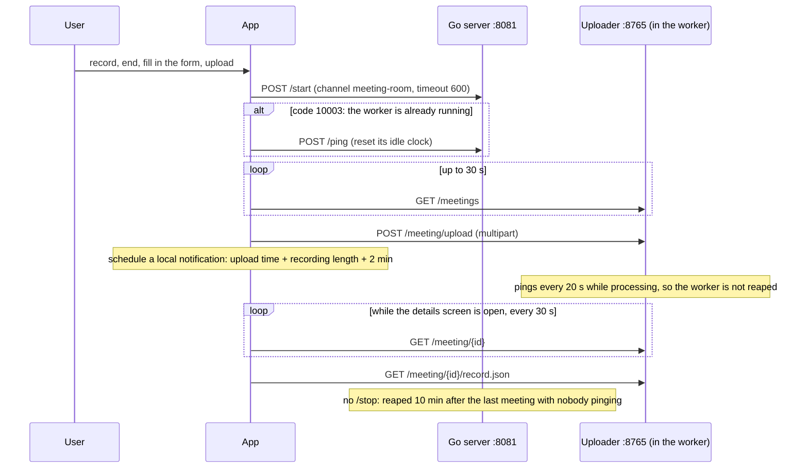
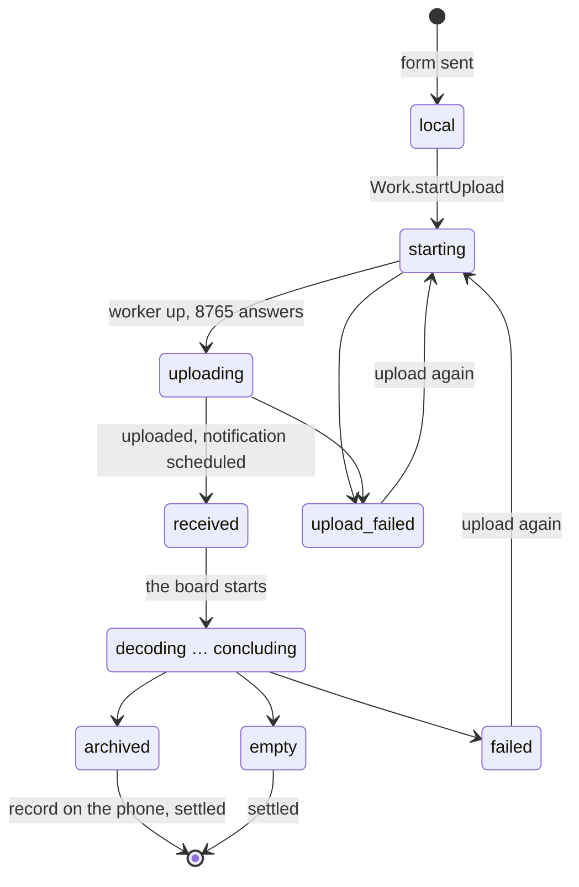

# Meeting minutes Android app — development guide

For whoever takes the app on. How to install and use it is in
[README.md](README.md); this guide covers how the code is organised, the
rules to keep when changing it, and how to test it.
Traditional Chinese: [DEVELOPMENT.zh-TW.md](DEVELOPMENT.zh-TW.md).

The phone only records, uploads and displays; all processing happens on the
meeting-room board. The app and the board talk plain HTTP over the LAN.

## Status (2026-10-08)

The prototype works: it has been tested on an Android phone against the
meeting-room board.

- What the app relies on from the board was checked on the board by script:
  - one worker shared by every meeting, `10003`, a reaped worker started
    again: `tools/ambarella/check_meeting_worker.py`;
  - the record converted to Traditional:
    `tools/ambarella/verify_meeting_board.sh --script traditional`.
- The first recordings, made with `MediaRecorder`, were turned away by the
  board with 415. Only once the app wrote the recording file itself (rule 12
  in section 5) did a meeting recorded on the phone go all the way to
  "done".
- What is not done yet is in section 8.

## 1. Toolchain

| Item | Version | Note |
| --- | --- | --- |
| JDK | 17 | |
| Android SDK | platform 35, build-tools 35 | path in `local.properties` (not in git) |
| Gradle | 8.10.2 | use the repo's `./gradlew`; nothing to install |
| Android Gradle Plugin / Kotlin | 8.7.2 / 2.0.21 | |
| Compose BOM | 2024.10.01 | Material 3 |
| minSdk / targetSdk | 29 / 35 | the built-in Opus encoder (`MediaCodec`) arrived in Android 10 |

```bash
cd ai_agents/meeting-app-android
echo "sdk.dir=/opt/android-sdk" > local.properties    # your SDK path
export JAVA_HOME=/usr/lib/jvm/java-17-openjdk-amd64   # your JDK 17

./gradlew :app:testDebugUnitTest                                    # every unit test
./gradlew :app:testDebugUnitTest --tests 'io.ten.meetingminutes.WorkTest'   # one class
./gradlew :app:assembleDebug     # → app/build/outputs/apk/debug/app-debug.apk
```

- In Android Studio, open the `ai_agents/meeting-app-android` folder, not the
  repo root.
- Built under WSL, the APK is reachable from Windows at
  `\\wsl.localhost\<distro>\...\app\build\outputs\apk\debug\`.
- **No CI builds or tests this app.** Run the unit tests locally before
  committing.

## 2. How the app talks to the board

| Port | What | What the app uses it for |
| --- | --- | --- |
| 8081 | Go API server | `/start` the meeting worker; `/ping` instead when it is already running |
| 8765 | the uploader, inside the worker | upload, state and progress, fetching `record.json` |

Something listens on 8765 only while the worker is alive, so the order is
always **`/start`, wait for 8765 to answer, then upload**.



### 2.1 One worker, shared by every meeting

Every meeting uses one channel: `meeting-room` (`Ids.CHANNEL` in
`domain/Small.kt`). The board has a single uploader port, so:

- A second `/start` answers `code 10003` (HTTP 400, channel exists). That is
  normal: the app pings once to reset the worker's idle clock (it may be a
  minute from being reaped), then uploads as usual (`Work.begin`).
- **The app never calls `/stop`.** The worker may be in the middle of
  someone else's meeting, and stopping it would make that meeting start over.
  `/start` passes `timeout` 600: with nobody pinging for 10 minutes after the
  last meeting, the Go server reaps it.
- If 8765 does not answer when a meeting is opened (the worker was reaped),
  `Work.refresh` calls `/start` again and reads the record back. That is safe:
  a fresh uploader marks meetings left half done as interrupted only once it
  holds the port (`_start` in `meeting_uploader/extension.py`), so a finished
  meeting is left as it is.
- One meeting at a time. An upload while another is processed gets 409, and
  the screen says which meeting is still in progress.

Do not go back to a channel per meeting: a second worker cannot get the port,
and an app stopping "its own" worker could kill the one processing someone
else's meeting.

### 2.2 Upload fields

`POST /meeting/upload`, multipart, with:

| Field | Content | The board's check |
| --- | --- | --- |
| `meeting_id` | made by the app, `yyyyMMdd-HHmmss-xxxx` (`Ids.meetingId`) | letters, digits, `-` and `_` only |
| `speakers` | number of attendees | at least 1, or 400 |
| `title` | meeting title, optional | |
| `recorded_at` | when recording started (Unix seconds) | |
| `script` | `traditional` or `simplified` | anything else is 400 |
| `file` | the whole meeting, Ogg-Opus 16 kHz mono | wrong format 415, too large 413 |

The token (the board's `MEETING_AUTH_TOKEN`) goes as `Authorization: Bearer`
to 8765 only, never to 8081.

### 2.3 Where the board's code is

The board's code is the specification; when in doubt, read:

| What | File |
| --- | --- |
| `/start`, `/ping`, and error code 10003 | `ai_agents/server/internal/http_server.go`, `code.go` |
| how a worker is reaped | `timeoutWorkers` in `ai_agents/server/internal/worker_common.go` |
| the uploader's endpoints, 409, the other errors | `ai_agents/agents/ten_packages/extension/meeting_uploader/server.py` |
| state file, `record.json`, the interrupted mark | `meeting_uploader/store.py` |
| keeping alive while processing | `meeting_uploader/keepalive.py` |
| the processing flow and each state | `ai_agents/agents/ten_packages/extension/meeting_control_python/flow.py` |

To walk through it by hand with curl: the meeting-minutes section of
`docs/development/board_quickstart.md`.

## 3. Code layout

```text
app/src/main/java/io/ten/meetingminutes/
├── MainActivity.kt            entry point; hands the notification's meeting_id to the UI
├── board/                     talking to the board (no Android API; tested on the JVM)
│   ├── BoardApi.kt            HTTP: start, ping, waitReady, upload, status, recordText
│   └── MeetingRecord.kt       record.json's model and parser
├── domain/
│   ├── Work.kt                the rules for uploading and asking (section 5)
│   ├── Minutes.kt             text for display and sharing: speaker number + 1, times
│   └── Small.kt               Ids, Estimate (notification time), Texts (states and errors in Chinese)
├── store/Store.kt             Settings, Meeting, MeetingStore
├── recording/
│   ├── RecorderService.kt     foreground service; Recording (current state, why a start failed); LeftBehind (recovery)
│   ├── OpusRecorder.kt        AudioRecord 16 kHz mono → Android's Opus encoder → the file
│   └── OggOpus.kt             OggOpusWriter (writes the Ogg headers and pages), Opus (packet length, pre-skip)
├── notify/DueReceiver.kt      Due: schedules and posts "the minutes should be ready"
└── ui/App.kt                  every Compose screen
```

- Dependencies point `ui → domain → board / store / notify`, never back.
- `Work.upload` and `Work.refresh` each come in two layers: the one the UI
  calls takes `Context` and `Settings`; the one the tests call takes
  `BoardApi`, `MeetingStore` and callbacks. The rules live only in the latter;
  the former just assembles arguments.
- No third-party libraries on purpose: HTTP is `HttpURLConnection`; screens
  are a `Screen` sealed interface plus `BackHandler`, no Navigation; no DI.
  Keep it that way without a good reason.

### 3.1 Where data lives

All in the app's private storage (`context.filesDir`):

| What | Where |
| --- | --- |
| board address, token, default script | SharedPreferences `settings` |
| the meeting list | `meetings.json` (read and written whole) |
| fetched records | `records/<meeting_id>.json`, exactly as the board sent it |
| recordings | `recordings/<ms when recording started>.ogg` |

On a debug build: `adb shell run-as io.ten.meetingminutes cat files/meetings.json`.

## 4. A meeting's states

`Meeting` in `store/Store.kt` is everything the phone knows about a meeting:

| Field | Meaning |
| --- | --- |
| `state` | the current state, see below |
| `uploadedAtMs` | when the upload succeeded; 0 if it has not |
| `done` / `total` | progress as the board reports it |
| `error` | an error for the user, already in Chinese |
| `settled` | the board has nothing more to give: the state is final and the record, if any, is on the phone |
| `names` | names the user gave the speakers; on the phone only |
| `file`, `script`, `speakers`, `title` | the recording's path, and the fields sent with the upload |

| State | Set by | Meaning |
| --- | --- | --- |
| `local` | app | created, not uploaded |
| `starting` | app | calling `/start`, waiting for 8765 |
| `uploading` | app | uploading |
| `upload_failed` | app | the upload failed; `error` says why |
| `received`, `decoding`, `transcribing`, `linking`, `summarising`, `concluding` | board | being processed |
| `archived` | board | done |
| `empty` | board | nobody spoke in the recording |
| `failed` | board | processing failed; the reason is in `error` |



`archived`, `empty` and `failed` are final (`Meeting.finished`). On a final
state `Work.refresh` fetches `record.json`. If an `archived` meeting's record
did not arrive, `settled` stays false and it is fetched next time; otherwise
a missing record still counts as settled, because the uploader's own failures
never write one.

## 5. Rules to know before changing the code

1. **An upload belongs to the process, not to a screen.** `Work.startUpload`
   runs it in a process-wide scope and records the meeting id in
   `Work.uploading`. Do not start an upload from a screen's
   `rememberCoroutineScope`: closing the form or turning the phone would
   cancel it.
2. **Sending again starts over.** `Work.upload` first clears `uploadedAtMs`,
   progress, the error and `settled`, and drops the old record on the phone;
   the board clears the last run of the same `meeting_id` too (`store.land`).
3. **A cut-off upload can be sent again.** `starting` or `uploading` while not
   in `Work.uploading` means the app was killed mid-upload. The details screen
   then offers "upload again" (`cutOff` in `DetailsScreen`).
4. **Ask only while the details screen is open.** `DetailsScreen` rereads the
   phone's data every 2 s (to show the upload moving) and asks the board every
   30 s, only while `askBoard` holds (uploaded, not settled). No background
   polling: Android's background work runs at most every 15 minutes and iOS
   does not allow it, so a notification fires at the estimated finish instead.
5. **The notification time is an estimate.** `Estimate.notifyAtMs` = upload
   time + recording length + 2 minutes. Measured on the board, processing
   takes 0.93 × the recording (38 minutes), 1.02 × (12 minutes) and 1.1 ×
   (4 minutes); the 2 extra minutes covered each. `Due` uses
   `setAndAllowWhileIdle`, an inexact alarm that Doze may delay. Android 13+
   needs the notification permission; without it there is no notification and
   everything else still works.
6. **A fetched record stays on the phone.** It reads offline afterwards and
   the board is not asked again.
7. **Speaker numbers are shown + 1.** `speaker` in `record.json` counts from
   0; the UI and the shared text say "speaker n+1", matching the board's
   `minutes.txt` (`Minutes.speaker`). Names the user gives live only in
   `Meeting.names`; the board never learns them.
8. **The board converts the script.** Each meeting chooses once at upload
   (default from Settings) and sends it as `script`; the board converts the
   whole record. The app only switches its own labels by `Meeting.script`
   (結論/结论, 話題/话题, 說話人/说话人); the app's own UI is always
   Traditional. The board uses OpenCC's `s2tw`, which changes character forms
   but not vocabulary, so 網絡 and 反饋 stay as they are. OpenCC reads 并发 as
   one word, so the board splits it before converting (`APART` in
   `meeting_control_python/script.py`). `s2twp` was tried and not taken: it
   turns every 发布 into 釋出.
9. **Recovery relies on the file name.** A recording is always named
   `<ms when recording started>.ogg`. At launch `LeftBehind.find` finds a
   recording no meeting holds, takes its start from the name and its length
   from the last-modified time, and brings back the upload form. Keep the
   naming if the recording code changes.
10. **`BoardApi` never lets a `JSONException` out.** A reply that is not the
    board's JSON (a Wi-Fi login page, say) becomes an `ApiError` instead of
    crashing the app inside a coroutine. Any new call that parses JSON goes
    through `BoardApi.parse`.
11. **`meetings.json` has one lock.** `MeetingStore`'s lock is shared by every
    instance (the companion's `LOCK`), because a background upload and a
    screen may each hold a different instance. Writes always go through `put`.
12. **The app writes the recording file itself; do not go back to
    `MediaRecorder`.** The board takes 16 kHz mono Ogg-Opus and answers 415
    to anything else. `MediaRecorder`'s Ogg output can be asked for 16 kHz
    mono, but Android writes the header itself, and on a real phone the board
    refused it with 415. So now `AudioRecord` records 16 kHz mono, Android's
    Opus encoder (`MediaCodec`) compresses it, and `OggOpusWriter` writes the
    Ogg: the sample rate and channel count in OpusHead are the app's, packet
    lengths come from each TOC, and a page goes out about every second, so an
    app killed mid-recording loses at most that second.
13. **Delete removes only what is on the phone.** `Work.delete` removes the
    recording, the fetched record, the list entry and a notification still
    due; the board's record stays. A meeting being uploaded cannot be deleted.
    The recording must go too, or at the next launch `LeftBehind` would offer
    it again as lost.

## 6. Tests

All JVM unit tests (`app/src/test`): no Robolectric, no on-device tests.

| Class | What | Count |
| --- | --- | --- |
| `BoardApiTest` | what each endpoint sends, how replies and errors are read | 10 |
| `WorkTest` | the worker rules: one channel, no `/stop`, ping on 10003, restart after reaping, settled; delete | 10 |
| `RecordTest` | parsing `record.json` | 3 |
| `MinutesTest` | speaker numbers, times, shared text | 4 |
| `SmallLogicTest` | meeting_id, notification time, states and errors in Chinese | 4 |
| `LeftBehindTest` | recovering a recording | 5 |
| `OggOpusTest` | the recording file: OpusHead, pages, CRC, granule, packet length, pre-skip | 8 |

`OggOpusTest` uses real Opus packets
(`src/test/resources/opus_packets_16k_mono.bin`: libsndfile encoded a made-up
three-second signal at 16 kHz mono, and its 151 packets were kept). The JVM
has no Opus decoder, so the test also saves the file it writes to
`app/build/test-output/oggopus-16k-mono.ogg`. After changing `OggOpus.kt`,
read that file once the way the board does (`soundfile`, in the dev
container): `sf.info` must say OGG / OPUS, 16000 Hz, mono; the uploader's
`store.check_audio` must let it in; and the decoded sound must line up with
the original.

Conventions:

- **Two MockWebServers stand in for the board**, one as the Go server and one
  as the uploader (on a fixed port). The mock Go server answers like the real
  one: `/start` on a running worker gets HTTP 400, `code 10003`.
- **"The worker was reaped" is a port refusing connections**: shut the mock
  uploader down (`WorkTest.reaped`). Do not use
  `SocketPolicy.DISCONNECT_AT_START`: the JDK's `HttpURLConnection` reads it
  as an empty HTTP 200, not a connection error.
- Android classes are stubs in unit tests
  (`unitTests.isReturnDefaultValues = true`); `org.json` has its real
  implementation as a test dependency.
- New behaviour starts with a failing test. When changing a rule in `Work`,
  also check that the test fails with the rule taken out.
- **Not covered by unit tests**: the Compose screens, `RecorderService` and
  `OpusRecorder` (the JVM has neither microphone nor encoder), `Due` and
  notifications. Test those on a phone (section 7).

## 7. Testing on a phone against the real board

1. Start the board as `docs/development/board_quickstart.md` says; the Go
   server is on 8081. For the app, have the board serve from power-on:
   `tools/ambarella/install_board_services.sh`, once, installs the LLM daemon
   and the Go server as systemd services. What the app relies on from the board (one shared
   worker, 10003, restart after reaping) can be checked without a phone:
   `python3.12 tools/ambarella/check_meeting_worker.py` on the board.
   With a phone, let the board watch: run
   `tools/ambarella/verify_meeting_board.sh --no-meeting --phone` on the board
   first; it waits for the meeting the app sends, follows it to the end, and
   checks the record, its script, the app's channel, and that the app left
   the worker running.
2. Install the APK: `adb install -r app/build/outputs/apk/debug/app-debug.apk`,
   or copy the APK to the phone and open it (allow installing unknown apps).
   Installed over an earlier build signed with the same machine's debug key,
   the app keeps its data.
3. Put the phone on the board's network and open
   `http://<board IP>:8081/graphs` in the phone's browser: JSON means the
   board is reachable.
4. In the app's settings, enter the board's IP (no `http://`, no port); if the
   board sets `MEETING_AUTH_TOKEN`, enter the token too.

| To test | How to trigger it |
| --- | --- |
| all the way to "done" | record 1–2 minutes of two or more people taking turns |
| nobody spoke (`empty`) | record silence |
| the board busy (409) | while one meeting is processed, upload another from a second phone or curl |
| wrong token (401) | the board sets `MEETING_AUTH_TOKEN`, the app has none |
| the board unreachable | a wrong IP in settings, or the phone off that network |
| reading after the worker was reaped | open a meeting more than 10 minutes after it finished |
| an upload cut off | force-stop the app from system settings while uploading, then open it |
| recovering a recording | force-stop the app after ending a recording and before sending the form, then open it |
| processing failed (`failed`) | while processing, `/stop` `meeting-room` with curl, then `/start`. A testing trick only: the app itself never calls `/stop` |
| delete | press "刪除" on a meeting's page: it leaves the list and does not come back as a lost recording after a restart |
| recording cannot start | press "開始錄音" during a phone call: the home screen says why in red; the app does not crash |

Debugging:

- The app writes no log. After a crash, `adb logcat -b crash`.
- The board's log is `/tmp/task_run.log` (when started as the quickstart says).

## 8. Known limits and to-do

- **A finished meeting's recording is not deleted automatically.** Only "刪除"
  on its page removes it; otherwise it stays in the app's private storage.
- The app writes no log.
- The UI text is in the code (`strings.xml` holds only `app_name`); no
  localisation.
- Settings do not check the IP's format.
- Plain HTTP; the token is the only protection (`network_security_config.xml`
  allows cleartext).
- Debug signing only.
- The board processes one meeting at a time.
- iOS has not been started.

## 9. Committing

- Conventional commits; the app's scope is `meeting-app`, for example
  `feat(meeting-app): ...`. Body lines at most 100 characters: commitlint runs
  only in CI, nothing stops it locally.
- Stage by path, never `git add -A`.
- `AGENTS.md` at the repo root is the rule.
