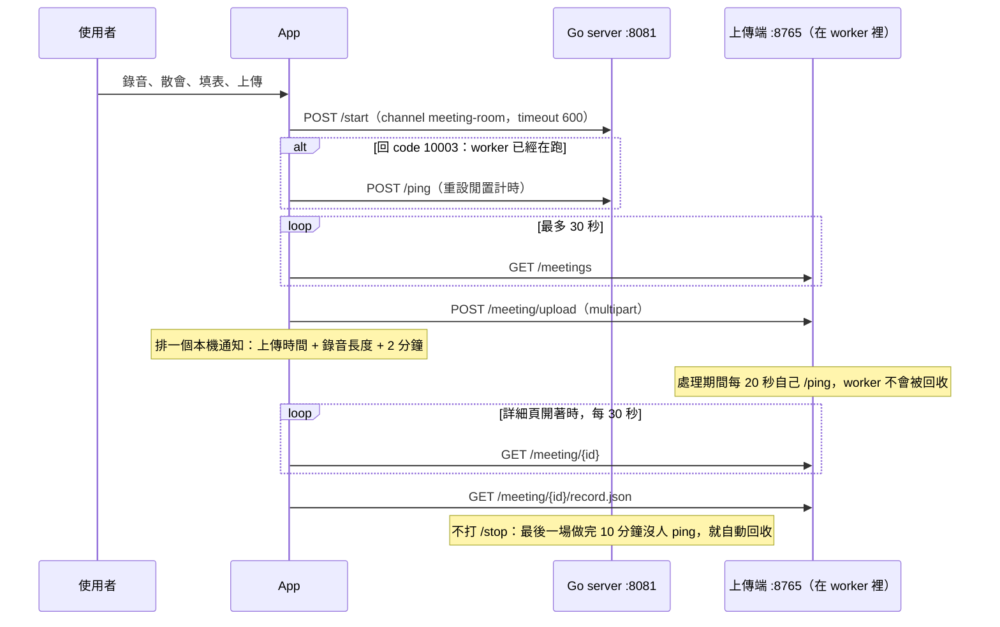
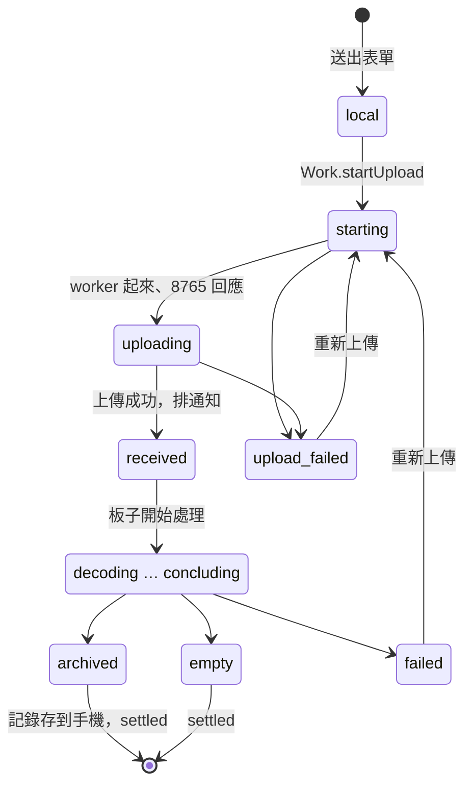

# 會議記錄 Android App — 開發說明

這份文件給要接手開發的人。怎麼安裝、怎麼操作請看 [README.md](README.md)；
這份講程式怎麼組織、改程式時要守哪些規則，以及怎麼測試。

手機只負責錄音、上傳和顯示，所有處理都在會議室的板子上。App 和板子之間只走
區網的 HTTP（明碼）。

## 1. 開發環境

| 項目 | 版本 | 備註 |
| --- | --- | --- |
| JDK | 17 | |
| Android SDK | platform 35、build-tools 35 | 路徑寫在 `local.properties`（不進 git） |
| Gradle | 8.10.2 | 用 repo 裡的 `./gradlew`，不用另外裝 |
| Android Gradle Plugin / Kotlin | 8.7.2 / 2.0.21 | |
| Compose BOM | 2024.10.01 | Material 3 |
| minSdk / targetSdk | 29 / 35 | Android 10 起 `MediaRecorder` 才能錄 Ogg-Opus |

```bash
cd ai_agents/meeting-app-android
echo "sdk.dir=/opt/android-sdk" > local.properties    # 換成你的 SDK 路徑
export JAVA_HOME=/usr/lib/jvm/java-17-openjdk-amd64   # 換成你的 JDK 17

./gradlew :app:testDebugUnitTest                                    # 全部單元測試
./gradlew :app:testDebugUnitTest --tests 'io.ten.meetingminutes.WorkTest'   # 只跑一個
./gradlew :app:assembleDebug     # → app/build/outputs/apk/debug/app-debug.apk
```

- 用 Android Studio 的話，開 `ai_agents/meeting-app-android` 這個資料夾，不要開 repo 根目錄。
- 在 WSL 裡編譯的話，Windows 可以從
  `\\wsl.localhost\<發行版>\...\app\build\outputs\apk\debug\` 拿到 APK。
- **CI 不會編譯也不會測這個 App。** commit 前請自己在本機跑過單元測試。

## 2. 跟板子怎麼互動

| Port | 是什麼 | App 拿它做什麼 |
| --- | --- | --- |
| 8081 | Go API server | `/start` 會議 worker；worker 已經在跑時改打 `/ping` |
| 8765 | 上傳端，跑在 worker 裡面 | 上傳、查狀態和進度、取回 `record.json` |

8765 只有在 worker 活著的時候才有人聽，所以順序一定是**先 `/start`，等 8765 回應，再上傳**。



### 2.1 一個 worker，所有會議共用

所有會議都用同一個 channel：`meeting-room`（`domain/Small.kt` 的 `Ids.CHANNEL`）。
板子上只有一個上傳端 port，所以：

- 第二次 `/start` 會得到 `code 10003`（HTTP 400，channel 已存在），這是正常的：
  App 打一次 `/ping` 重設 worker 的閒置計時（它可能再一分鐘就要被回收了），然後照常上傳
  （`Work.begin`）。
- **App 從不打 `/stop`。** worker 可能正在處理別人的會議，停掉的話那場就得從頭再來。
  `/start` 帶的 `timeout` 是 600 秒，最後一場做完後 10 分鐘內沒人 ping，Go server 就會回收它。
- 如果打開一場會議時 8765 連不上（worker 已經被回收），`Work.refresh` 會再 `/start` 一次，
  把記錄讀回來。這樣做是安全的：新起來的上傳端要先拿到 port，才會把「沒走到最終狀態」的
  會議標成中斷失敗（`meeting_uploader/extension.py` 的 `_start`），已經結束的會議不會被動到。
- 一次只處理一場。處理中再上傳會回 409，畫面會顯示是哪一場還在處理。

不要改回「每場會議一個 channel」：第二個 worker 拿不到 port，而 App 停掉「自己的」
worker 時，可能剛好殺掉正在處理別人會議的那個。

### 2.2 上傳欄位

`POST /meeting/upload`，multipart，欄位：

| 欄位 | 內容 | 板子的檢查 |
| --- | --- | --- |
| `meeting_id` | App 產生，`yyyyMMdd-HHmmss-xxxx`（`Ids.meetingId`） | 只能有英數、`-`、`_` |
| `speakers` | 與會人數 | 要 ≥ 1，否則 400 |
| `title` | 會議標題，可省略 | |
| `recorded_at` | 開始錄音的時間（Unix 秒） | |
| `script` | `traditional` 或 `simplified` | 其他值回 400 |
| `file` | 整場錄音，Ogg-Opus 16 kHz 單聲道 | 格式不對回 415，太大回 413 |

權杖（板子的 `MEETING_AUTH_TOKEN`）只用 `Authorization: Bearer` 送給 8765，不送給 8081。

### 2.3 板子端的程式在哪

API 規格以板子端的程式為準，有疑問就讀這幾個地方：

| 要看什麼 | 檔案 |
| --- | --- |
| `/start`、`/ping`，以及錯誤碼 10003 | `ai_agents/server/internal/http_server.go`、`code.go` |
| worker 怎麼被回收 | `ai_agents/server/internal/worker_common.go` 的 `timeoutWorkers` |
| 上傳端的端點、409、各種錯誤 | `ai_agents/agents/ten_packages/extension/meeting_uploader/server.py` |
| 狀態檔、`record.json`、中斷標記 | `meeting_uploader/store.py` |
| 處理期間的保活 | `meeting_uploader/keepalive.py` |
| 處理流程和每個狀態 | `ai_agents/agents/ten_packages/extension/meeting_control_python/flow.py` |

用 curl 手動走一遍：`docs/development/board_quickstart.zh-TW.md` 的會議記錄一節。

## 3. 程式結構

```text
app/src/main/java/io/ten/meetingminutes/
├── MainActivity.kt            進入點；把通知帶來的 meeting_id 交給畫面
├── board/                     跟板子講話（不碰 Android API，可在 JVM 上測）
│   ├── BoardApi.kt            HTTP：start、ping、waitReady、upload、status、recordText
│   └── MeetingRecord.kt       record.json 的資料模型與解析
├── domain/
│   ├── Work.kt                上傳和查詢的流程規則（第 5 節）
│   ├── Minutes.kt             顯示和分享用的文字：說話人編號 +1、時間
│   └── Small.kt               Ids、Estimate（通知時間）、Texts（狀態與錯誤的中文）
├── store/Store.kt             Settings、Meeting、MeetingStore
├── recording/RecorderService.kt   前景服務錄音；Recording（目前狀態）；LeftBehind（救回錄音）
├── notify/DueReceiver.kt      Due：排程並發出「會議記錄應該好了」通知
└── ui/App.kt                  所有 Compose 畫面
```

- 依賴方向是 `ui → domain → board / store / notify`，反過來不行。
- `Work.upload` 和 `Work.refresh` 都有兩層：給畫面用的版本吃 `Context`、`Settings`；
  給測試用的版本吃 `BoardApi`、`MeetingStore` 和 callback。規則只寫在後者，前者只負責組裝參數。
- 刻意不用第三方函式庫：HTTP 用 `HttpURLConnection`；換頁用 `Screen` sealed interface
  加 `BackHandler`，沒有 Navigation；也沒有 DI。沒有充分理由，請維持這樣。

### 3.1 資料存放

都在 App 的私有空間（`context.filesDir`）：

| 什麼 | 在哪 |
| --- | --- |
| 板子位址、權杖、預設繁簡 | SharedPreferences `settings` |
| 會議清單 | `meetings.json`（整個檔一次讀寫） |
| 取回的記錄 | `records/<meeting_id>.json`，原封不動存板子給的內容 |
| 錄音 | `recordings/<開始錄音的毫秒>.ogg` |

debug 版可以直接看：`adb shell run-as io.ten.meetingminutes cat files/meetings.json`。

## 4. 一場會議的狀態

`store/Store.kt` 的 `Meeting` 是手機對一場會議所知道的全部：

| 欄位 | 意思 |
| --- | --- |
| `state` | 目前狀態，見下表 |
| `uploadedAtMs` | 上傳成功的時間；0 代表還沒傳成功 |
| `done` / `total` | 板子回報的進度 |
| `error` | 要給使用者看的錯誤，已經轉成中文 |
| `settled` | 板子已經沒有新東西可給：狀態是最終的，而且記錄（如果有的話）已經存在手機上 |
| `names` | 使用者幫說話人取的名字，只存在手機上 |
| `file`、`script`、`speakers`、`title` | 錄音檔路徑，以及上傳時送出的欄位 |

| 狀態 | 誰設的 | 意思 |
| --- | --- | --- |
| `local` | App | 已經建立，還沒上傳 |
| `starting` | App | 正在 `/start`，等 8765 回應 |
| `uploading` | App | 正在上傳 |
| `upload_failed` | App | 沒傳成功，`error` 寫了原因 |
| `received`、`decoding`、`transcribing`、`linking`、`summarising`、`concluding` | 板子 | 處理中 |
| `archived` | 板子 | 完成 |
| `empty` | 板子 | 錄音裡沒有人說話 |
| `failed` | 板子 | 處理失敗，原因在 `error` |



`archived`、`empty`、`failed` 是最終狀態（`Meeting.finished`）。到了最終狀態，`Work.refresh`
會去取 `record.json`。如果是 `archived` 但記錄沒取到，`settled` 保持 false，下次再取；
其他情況取不到也算 settled，因為上傳端自己判定的失敗本來就不會寫出記錄。

## 5. 改程式前先知道的規則

1. **上傳屬於整個程式，不屬於某個畫面。** `Work.startUpload` 把上傳放在跟著 process 的
   scope 裡，並把會議 id 記在 `Work.uploading`。不要在畫面的 `rememberCoroutineScope` 裡
   啟動上傳，不然表單一關、手機一轉，上傳就被取消了。
2. **重傳就是從頭來。** `Work.upload` 會先清掉 `uploadedAtMs`、進度、錯誤和 `settled`，
   刪掉手機上的舊記錄；板子收到同一個 `meeting_id` 也會清掉上一輪（`store.land`）。
3. **中斷的上傳要能重來。** 狀態是 `starting` 或 `uploading`，但不在 `Work.uploading` 裡，
   代表 App 在上傳途中被殺掉了。詳細頁這時會顯示「重新上傳」（`DetailsScreen` 的 `cutOff`）。
4. **只在詳細頁開著時查詢。** `DetailsScreen` 每 2 秒重讀手機上的資料（才看得到上傳的進度），
   每 30 秒問一次板子，而且只在 `askBoard` 成立時問（已經上傳、還沒 settled）。
   不在背景輪詢：Android 的背景工作最快 15 分鐘一次，iOS 則不允許，所以改成在估計的完成時間發通知。
5. **通知時間是估的。** `Estimate.notifyAtMs` = 上傳時間 + 錄音長度 + 2 分鐘，根據是板子上
   實測處理時間約為錄音長度的 0.93 倍。`Due` 用 `setAndAllowWhileIdle`，是不精確的鬧鐘，
   Doze 時可能延後。Android 13 以上要有通知權限；沒給權限的話只是收不到通知，其他功能照常。
6. **記錄取回後就存在手機上。** 之後離線也能看，不再問板子。
7. **說話人編號要加 1。** `record.json` 的 `speaker` 從 0 開始，畫面和分享都顯示
   「說話人 n+1」，才會和板子的 `minutes.txt` 對得上（`Minutes.speaker`）。使用者取的名字
   只存在 `Meeting.names`，板子永遠不知道。
8. **繁簡由板子轉換。** 每場會議上傳時選一次（預設值來自設定），用 `script` 欄位送出，
   板子會把整份記錄轉成那個字體。App 只依 `Meeting.script` 切換自己加上去的標籤
   （結論／结论、話題／话题、說話人／说话人）；App 自己的介面一律是繁體。
9. **救回錄音靠檔名。** 錄音檔一律命名為 `<開始錄音的毫秒>.ogg`。App 啟動時，
   `LeftBehind.find` 會找出沒有對應會議的錄音，用檔名當開始時間、用最後修改時間推算長度，
   再把上傳表單叫回來。改錄音的寫法時，請保留這個命名方式。
10. **`BoardApi` 不讓 `JSONException` 漏出去。** 位址上回的如果不是板子的 JSON（例如 Wi-Fi
    登入頁），會變成 `ApiError`，不會在 coroutine 裡炸掉整個 App。新增需要解析 JSON 的呼叫時，
    請一律走 `BoardApi.parse`。
11. **`meetings.json` 只有一把鎖。** `MeetingStore` 的鎖是所有實例共用的（companion 的
    `LOCK`），因為背景上傳和畫面可能各自拿著不同的實例。寫入一律透過 `put`。
12. **錄音格式不能隨便改。** `MediaRecorder` 設成 OGG / OPUS、16 kHz、單聲道、24 kbps，這是
    板子唯一接受的格式，其他格式會回 415。要改就得兩邊一起改。

## 6. 測試

全部是 JVM 單元測試（`app/src/test`），沒有 Robolectric，也沒有裝置上的測試。

| 檔案 | 測什麼 | 數量 |
| --- | --- | --- |
| `BoardApiTest` | 每個端點送什麼、怎麼解讀回應和錯誤 | 10 |
| `WorkTest` | worker 的規則：一個 channel、不 `/stop`、10003 時 ping、回收後重開、settled | 8 |
| `RecordTest` | `record.json` 解析 | 3 |
| `MinutesTest` | 說話人編號、時間、分享文字 | 4 |
| `SmallLogicTest` | meeting_id、通知時間、狀態和錯誤的中文 | 4 |
| `LeftBehindTest` | 救回錄音 | 5 |

寫測試的慣例：

- **用兩個 MockWebServer 模擬板子**，一個當 Go server，一個當上傳端（固定 port）。
  模擬的 Go server 和真的一樣：worker 已經在跑時，`/start` 會回 HTTP 400、`code 10003`。
- **「worker 被回收」要做成 port 拒絕連線**：把模擬的上傳端關掉（`WorkTest.reaped`）。
  不要用 `SocketPolicy.DISCONNECT_AT_START`，因為 JDK 的 `HttpURLConnection` 會把它當成
  內容是空的 HTTP 200，而不是連線錯誤。
- 單元測試裡的 Android 類別都是空殼（`unitTests.isReturnDefaultValues = true`）；
  `org.json` 則另外加了真的實作當測試依賴。
- 新的行為先寫一個會失敗的測試。改 `Work` 裡的規則時，也要確認拿掉那條規則後測試真的會失敗。
- **單元測試沒有涵蓋**：Compose 畫面、`RecorderService`、`Due` 和通知。這些要在手機上測（第 7 節）。

## 7. 在手機上對真的板子測

1. 板子照 `docs/development/board_quickstart.zh-TW.md` 啟動，Go server 在 8081。
   App 依賴的板子端行為（共用一個 worker、10003、回收後重開）可以先不用手機，在板子上跑
   `python3.12 tools/ambarella/check_meeting_worker.py` 驗證。
2. 手機連上跟板子同一個網路，然後 `adb install -r app/build/outputs/apk/debug/app-debug.apk`。
3. 到 App 的「設定」填板子的 IP；板子有設 `MEETING_AUTH_TOKEN` 的話，權杖也要填。

| 要測的 | 怎麼觸發 |
| --- | --- |
| 正常走到「完成」 | 錄 1–2 分鐘、兩個人以上輪流說話 |
| 錄音裡沒有說話（`empty`） | 錄一段沒人說話的 |
| 板子忙碌（409） | 一場還在處理時，用另一支手機或 curl 再上傳一場 |
| 權杖錯誤（401） | 板子設了 `MEETING_AUTH_TOKEN`，App 不填權杖 |
| 連不上板子 | 設定填錯 IP，或手機離開那個網路 |
| worker 被回收後讀取 | 會議處理完超過 10 分鐘才打開它 |
| 上傳途中被中斷 | 上傳中到系統設定把 App 強制停止，再打開 App |
| 救回錄音 | 結束錄音後、送出表單前把 App 強制停止，再打開 App |
| 處理失敗（`failed`） | 處理中用 curl 對 `meeting-room` 打 `/stop`，再 `/start`。這只是測試手段，App 本身從不打 `/stop` |

除錯：

- App 自己沒有寫 log。閃退的話看 `adb logcat -b crash`。
- 板子那邊的 log 在 `/tmp/task_run.log`（照快速上手文件啟動時）。

## 8. 已知限制與待辦

- **錄音檔不會被刪掉。** 只有按「捨棄」會刪，會議完成後錄音還是留在 App 的私有空間，
  會一直累積下去。
- **開始錄音時麥克風被佔用會閃退。** 例如正在講電話：`RecorderService.begin` 裡的
  `MediaRecorder.prepare()` / `start()` 丟出的例外沒有被接住。
- App 沒有 log。
- 畫面上的文字直接寫在程式裡（`strings.xml` 只有 `app_name`），沒有做多語系。
- 設定頁不檢查 IP 的格式。
- 走明碼 HTTP，唯一的保護是權杖（`network_security_config.xml` 允許明碼）。
- 只有 debug 簽章。
- 板子一次只處理一場會議。
- iOS 還沒開始做。

## 9. 提交

- commit message 用 conventional commits，App 的 scope 用 `meeting-app`，例如
  `feat(meeting-app): ...`。內文每行不超過 100 個字元，因為 commitlint 只在 CI 上跑，
  本機不會擋。
- 用路徑逐一 stage，不要 `git add -A`。
- 規則以 repo 根目錄的 `AGENTS.md` 為準。
