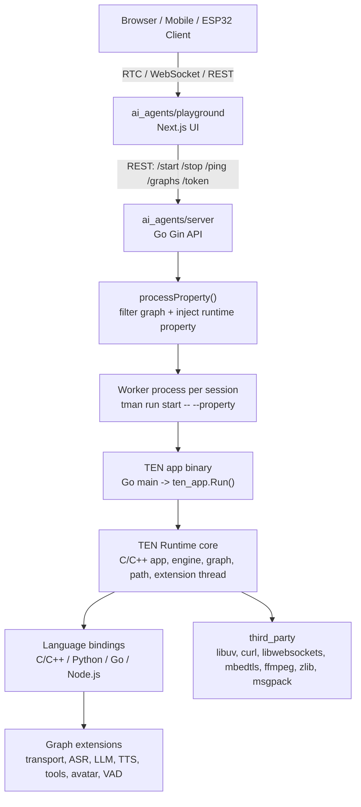
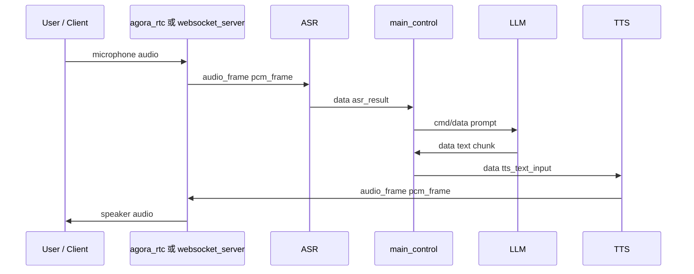
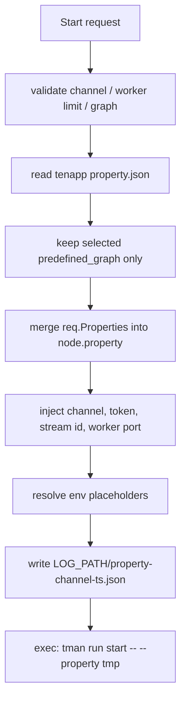

# TEN Framework 工程教學手冊

這份手冊從原始碼、建置腳本、Docker 設定與倉庫文檔整理 TEN Framework 的工程架構。目標不是快速展示，而是讓開發者知道這個 framework 由哪些模組組成、每個模組解決什麼問題、代碼應該從哪裡讀、怎麼二次開發、怎麼驗證、怎麼看日誌，以及移植到 arm64 時如何確認沒有遺漏。

本文主要對應以下路徑：

- `core/`：TEN Runtime 核心，C/C++ 實作，負責 app、graph、extension、message、thread、protocol、telemetry。
- `packages/`：runtime package、生態 package、template、example package。
- `build/`、`core/ten_gn/`：GN/tgn 建置系統與 TEN package 輸出規則。
- `ai_agents/`：agent examples、Go API server、Next playground、extension 集合、Docker、測試腳本。
- `docs/ai/`：倉庫內給工程代理讀取的架構摘要與 L2 deep dive。
- `docs/development/arm64_build.md`：arm64 支援狀態與 ABI 條件。

## 1. 一句話定位

TEN Framework 是一個圖驅動的即時多模態 runtime。它把 RTC/WebSocket transport、ASR、LLM、TTS、工具調用、avatar、VAD、turn detection、message collector 等能力拆成 extension，再用 `property.json` 裡的 graph 把 extension 組成一條可運行的音訊、文字、影像與命令管線。

這個設計解決的核心問題是：即時 AI 應用不能只靠一個主程式塞滿所有 vendor SDK 和業務邏輯。它需要可替換的模組、跨語言擴展、統一 lifecycle、統一 message routing、session 隔離、配置注入、可測試的 graph，以及可部署的 package。

## 2. 系統總圖



執行時的關鍵邊界：

- UI 或外部 client 不直接啟動 extension，而是呼叫 Go API server。
- Go API server 為每個 session 產生一份臨時 `property.json`，再啟動 worker。
- Worker 跑的是 TEN app binary，TEN app 透過 runtime 讀取 graph 並載入 extension。
- Extension 之間不直接互相呼叫，而是透過 runtime 傳 `cmd`、`data`、`audio_frame`、`video_frame`。
- Python、Go、Node.js、C/C++ extension 共用同一套 lifecycle 與 message 模型。

## 3. 目錄與模組導讀

| 路徑 | 功能 | 優先讀法 |
| --- | --- | --- |
| `core/include/ten_runtime/` | public C API，定義 app、extension、message、ten_env | 先讀 `ten.h`，再讀 `extension/`、`msg/`、`ten_env/` |
| `core/src/ten_runtime/` | runtime 實作 | 從 `BUILD.gn` 看 target，再追 `app`、`engine`、`extension_thread`、`msg` |
| `core/src/ten_runtime/binding/python/` | Python binding 與 async wrapper | 讀 `interface/ten_runtime/extension.py`、`async_extension.py`、`async_ten_env.py` |
| `core/src/ten_runtime/binding/go/` | Go binding | 讀 `interface/ten_runtime/extension.go`、`ten_env.go` |
| `core/src/ten_runtime/binding/nodejs/` | Node.js binding | 讀 `interface/ten_runtime/extension.ts`、`ten_env.ts` |
| `packages/` | runtime package、template、example package | 從 `packages/core_*` 和 `packages/example_*` 看 package 類型 |
| `build/` | GN build options 和 TEN build template | 讀 `build/options.gni`、`build/ten_runtime/options.gni`、`build/ten_runtime/ten.gni` |
| `core/ten_gn/` | `tgn` 與 TEN package 輸出模板 | 讀 `.gnfiles/build/feature/ten_package.gni` |
| `ai_agents/server/` | agent session API server | 讀 `main.go`、`internal/http_server.go`、`worker_linux.go`、`config.go` |
| `ai_agents/agents/` | agent app、extension、examples | 先讀 `manifest.json`、`property.json`、`Taskfile.yml` |
| `ai_agents/agents/examples/` | 可運行 example | `voice-assistant` 和 `websocket-example` 是最重要的兩條路徑 |
| `ai_agents/playground/` | Next.js playground | 從 RTC/RTM manager、agent hooks、chat config UI 讀 |
| `ai_agents/esp32-client/` | ESP32 端側 client | 看 board config、RTC/audio/video process |
| `tools/docker_for_building/` | core build image 依賴清單 | 當成 Linux build package manifest 讀 |

## 4. Core Runtime 原理

### 4.1 App

TEN app 是 runtime 的宿主。C API 在 `core/include/ten_runtime/app/app.h`，提供：

- `ten_app_create()` / `ten_app_destroy()`：建立與釋放 app。
- `ten_app_run()` / `ten_app_wait()`：啟動 runtime event loop 並等待結束。
- `ten_app_close()`：關閉 app。
- `ten_app_get_ten_env()`：取得 app 層環境物件。

在 AI agents example 裡，TEN app 是 Go 寫的。`tenapp/main.go` 會解析 `--property`，讀入 server 產生的 JSON，呼叫 `InitPropertyFromJSONBytes()`，然後 `Run(true)`。

### 4.2 Extension

Extension 是 TEN 的最小業務單元。C API 定義在 `core/include/ten_runtime/extension/extension.h`。完整 lifecycle 是：

```text
on_configure
  -> on_init
  -> on_start
  -> on_cmd / on_data / on_audio_frame / on_video_frame
  -> on_stop
  -> on_deinit
```

每個 lifecycle callback 都必須在適當時機呼叫對應的 `ten_env.on_xxx_done()`。Python/Go/Node 預設 wrapper 會幫空實作自動 done，但實際 extension 有 async 任務或外部連線時，要確保停止流程能釋放資源。

### 4.3 Message

Runtime message 分成四個主要業務類型：

| 類型 | 用途 |
| --- | --- |
| `cmd` | 命令請求，例如 user joined、tool register、flush、start/stop 類事件 |
| `cmd_result` | 命令回覆 |
| `data` | 結構化資料，例如 ASR 結果、LLM chunk、tool result |
| `audio_frame` | PCM 等音訊幀 |
| `video_frame` | RGB/RGBA/I420/NV12 等影像幀 |

Message routing 有兩個重要特性：

- graph connection 定義 message 從哪個 extension 到哪個 extension。
- 同一 message 可以一對一，也可以在離開 extension 時一對多 fan-out。

所以即時音訊 pipeline 不應該在 downstream extension 私自複製，而應該在 graph source 端拆分。例如同一份 microphone audio 要送 ASR 和 recorder，應從 transport 或 adapter 節點做多目標輸出。

### 4.4 TenEnv

`ten_env` 是 extension 與 runtime 互動的唯一正式入口。它提供：

- `send_cmd()`、`send_data()`、`send_audio_frame()`、`send_video_frame()`。
- `return_result()`。
- `get_property_*()`、`set_property_*()`。
- `log_debug()`、`log_info()`、`log_warn()`、`log_error()`。
- `on_configure_done()`、`on_init_done()`、`on_start_done()`、`on_stop_done()`、`on_deinit_done()`。

Python 的 property getter 會回傳 `(value, error)` tuple，不能直接當 value 用。這是常見二次開發錯誤。

## 5. Graph 與資料流

Graph 定義在 app 的 `property.json`。每個 node 對應一個 extension instance：

```json
{
  "type": "extension",
  "name": "stt",
  "addon": "deepgram_asr_python",
  "extension_group": "stt",
  "property": {
    "params": {
      "api_key": "${env:DEEPGRAM_API_KEY}"
    }
  }
}
```

Connection 以某個 extension 的視角描述它接收或送出的 message。這點容易讀錯：

- `source`：這個 extension 從哪些來源接收 message。
- `dest`：這個 extension 把 message 發往哪些目的地。

典型 voice assistant pipeline：



實際 `voice-assistant` example 裡還有：

- `streamid_adapter`：處理 RTC stream id 與 audio frame 路由。
- `message_collector2`：收集可送回前端的 data。
- tool extension：例如 `weatherapi_tool_python`。
- 多個 graph variant：deepgram/xai/oracle/smallest/anthropic 等組合。

## 6. AI Agents Server 原理

Go API server 是 agent examples 的 session controller。主要 endpoint：

| Endpoint | 功能 |
| --- | --- |
| `GET /health` | server 存活檢查 |
| `GET /graphs` | 讀取 `property.json` 中可用 graph |
| `POST /start` | 建立 session worker |
| `POST /stop` | 停止 session worker |
| `POST /ping` | session 保活 |
| `GET /list` | 列出 worker |
| `POST /token/generate` | 產生 Agora token 或回傳 app id fallback |

`/start` 的核心流程：



重要安全與行為：

- client 傳入的 `tenapp_dir` 被忽略，server 只用啟動參數指定的 app dir。
- channel name 會被 sanitize，避免路徑穿越與非法 filename。
- property merge 是遞迴 merge，不是簡單覆蓋整個 object。
- `startPropMap` 會把 request 欄位映射到 extension property，例如 `agora_rtc.channel`、`agora_rtc.token`、`http_server.listen_port`。
- worker 是 process group；Linux/macOS stop 先 SIGTERM，再超時 SIGKILL。

## 7. Build 與 Package 系統

TEN 的 build 分兩層：

```text
Taskfile
  -> tgn
      -> GN args / Ninja
          -> core runtime shared libs
          -> language bindings
          -> addon loaders
          -> app / extension / protocol / system packages
  -> tman
      -> install dependency packages
      -> run app
      -> package / publish
```

根目錄 `BUILD.gn` 的總 target `ten_framework_all` 會依 build flag 包含：

- `core/src/ten_runtime`
- `core/src/ten_runtime/binding`
- `packages/core_addon_loaders`
- `packages/core_apps`
- `packages/core_extensions`
- `packages/core_protocols`
- `packages/core_systems`
- `packages/example_apps`
- `packages/example_extensions`
- `third_party`
- 可選的 `core/src/ten_rust`、`core/src/ten_manager`、`tests`

TEN package 輸出位置由 `ten_package.gni` 決定：

| package type | 輸出 |
| --- | --- |
| app | `out/<os>/<arch>/app/<name>` |
| extension | `out/<os>/<arch>/ten_packages/extension/<name>` |
| protocol | `out/<os>/<arch>/ten_packages/protocol/<name>` |
| addon_loader | `out/<os>/<arch>/ten_packages/addon_loader/<name>` |
| system | `out/<os>/<arch>/ten_packages/system/<name>` |

## 8. Docker 與開發環境

`ai_agents/docker-compose.yml` 定義主要 dev container：

- service name：`ten_agent_dev`
- default image：`ghcr.io/ten-framework/ten_agent_build:0.7.14`
- default platform：`linux/amd64`
- mount：`./:/app`
- ports：Go API `8080`、playground `3000`、graph designer `49483`、worker port range `8000-9001`
- env source：`ai_agents/.env`

Release Dockerfile 是兩段式：

- builder：用 build image 跑 `task install && task release`。
- runtime：`ubuntu:22.04`，複製 `.release` 與 `server/bin/api`，entrypoint 是 API server。

ARM dev Dockerfile 使用 Ubuntu 24.04 arm64，並設定：

```bash
TEN_PYTHON_LIB_PATH=/usr/lib/aarch64-linux-gnu/libpython3.12.so
```

這不是可選細節。arm64 prebuilt packages 的 Python binding 是用 Python 3.12 headers 建的，loader 預設卻找 `libpython3.10.so`，所以必須指定正確 libpython。

## 9. 如何開始

### 9.1 跑 AI agent example

標準路徑：

```bash
cd ai_agents
cp .env.example .env
docker compose up -d
docker exec -it ten_agent_dev bash

cd /app/agents/examples/voice-assistant
task install
task run
```

看 log：

```bash
tail -f /tmp/task_run.log
```

如果要避開 RTC 依賴，尤其在 arm64 上，優先跑：

```bash
cd /app/agents/examples/websocket-example
task install
task run
```

### 9.2 從源碼建 core runtime

```bash
git submodule update --init --recursive --depth 1 core/ten_gn
export PATH=$(pwd)/core/ten_gn:$PATH

task gen
task build
```

需要直接指定平台時：

```bash
tgn gen linux arm64 release -- is_clang=false
tgn build linux arm64 release
```

實際生效的 GN flags 要看：

```bash
core/ten_gn/.gnfiles/bin/linux/arm64/gn args out/linux/arm64 --list
```

## 10. 二次開發

### 10.1 新增 Python extension

建議先複製同類型 extension，而不是從空白模板開始：

```text
ai_agents/agents/ten_packages/extension/
  deepgram_asr_python/
  elevenlabs_tts2_python/
  openai_llm2_python/
```

最小開發步驟：

1. 複製同類型 extension 目錄。
2. 修改 `manifest.json` 的 name、version、dependencies。
3. 確認 addon decorator 名稱、manifest name、graph node addon 三者一致。
4. 用 Pydantic 或現有 config 類解析 `property`。
5. `to_str()` 裡對 API key、token、secret 做 redaction。
6. 在 `property.json` graph 裡加 node。
7. 在 graph connection 裡接上 `cmd`、`data`、`audio_frame` 或 `video_frame`。
8. 跑 `task install`，完整重啟 `task run`。

### 10.2 新增 ASR/TTS/LLM provider

ASR extension 要穩定輸出：

- `asr_result`
- error/vendor info
- finalize/end event
- metrics 或延遲資訊

TTS extension 要遵守 TTS2 狀態機：

```text
QUEUED -> PROCESSING -> FINALIZING -> COMPLETED
```

並確保：

- 收到文字後輸出 `tts_audio_start`。
- 中間輸出 `pcm_frame`。
- 結束輸出 `tts_audio_end`。
- flush/interrupt 後不再輸出舊 request 的 audio。
- empty input 必須快速結束，不能卡住 pipeline。

### 10.3 改 graph

Graph 改動要同時檢查三件事：

```text
node exists
  -> addon package installed
      -> connection message name matches extension implementation
```

常見錯誤：

- node `addon` 寫錯，runtime 找不到 package。
- connection 的 `name` 與 extension 實際送出的 message name 不一致。
- audio fan-out 放錯位置，導致只有其中一個 downstream 收到 frame。
- graph 改了但沒有完整重啟。
- env placeholder 在 nested `params` 內，server 不一定提前報錯，直到 worker 啟動或 extension 初始化才失敗。

### 10.4 改 server

改 `/start` 或 property injection 時，要讀：

- `ai_agents/server/internal/http_server.go`
- `ai_agents/server/internal/config.go`
- `ai_agents/server/internal/worker_linux.go`
- `ai_agents/server/internal/worker_windows.go`

驗證點：

- channel sanitize 不可放寬。
- 不要讓 client 覆蓋 `tenapp_dir`。
- worker map、timeout、stop 流程不能造成 zombie worker。
- 新增 start request 欄位時，要更新 `startPropMap` 或明確說明由哪個 extension property 消費。

## 11. 驗證策略

### 11.1 Core runtime

最低驗證：

```bash
task gen
task build
```

若改動 runtime、binding、message、thread、graph routing，必須啟用 tests 並跑 `tests/ten_runtime` 下的 unit/smoke/integration binary。重點測試類別包括：

- graph syntax / predefined graph / graph communication
- cmd result / return / result conversion
- data / audio_frame / video_frame
- extension lifecycle / extension group / same thread callback
- path routing / multi dest / no connection
- schema / msg property / msg conversion
- timer / telemetry / lock / concurrent

### 11.2 AI agents

基本 endpoint 驗證：

```bash
curl http://localhost:8080/health
curl http://localhost:8080/graphs
curl http://localhost:8080/list
```

Session 驗證要覆蓋：

1. `/start` 能產生 worker。
2. `$LOG_PATH/property-<channel>-<ts>.json` 存在且注入值正確。
3. `$LOG_PATH/app-<channel>-<ts>.log` 有 extension lifecycle log。
4. `/ping` 能保活。
5. `/stop` 能停止 worker。
6. 停止後 `ps aux | grep 'bin/worker --property'` 沒有殘留。

### 11.3 Extension

單 extension 測試適合驗證 config parsing、vendor client mock、message output。

ASR/TTS guarder 測試適合驗證 pipeline contract。TTS guarder 應覆蓋 append、stress、interrupt、sample rate、dump、flush、interleaved requests、invalid params、malformed text、metrics、missing params。ASR guarder 應覆蓋長 stream 以外的核心 contract、錯誤分類、finalize、metrics。

### 11.4 Native binary

懷疑 package、ABI、架構錯誤時，用：

```bash
file ten_packages/system/ten_runtime/lib/libten_runtime.so
ldd ten_packages/system/ten_runtime/lib/libten_runtime.so
readelf -d ten_packages/system/ten_runtime/lib/libten_runtime.so
objdump -p ten_packages/system/ten_runtime/lib/libten_runtime.so
```

要確認：

- ELF 架構正確，例如 x86-64 或 AArch64。
- `NEEDED` library 都存在。
- `RUNPATH`/`RPATH` 能找到相對目錄。
- glibc symbol version 不高於目標系統。

## 12. 日誌分析

### 12.1 日誌位置

| 位置 | 內容 | 用途 |
| --- | --- | --- |
| `/tmp/task_run.log` | `task run` 時三個服務的 stdout：designer、frontend、Go API server | 服務起不來、port conflict、server 啟動錯誤 |
| `$LOG_PATH/property-<channel>-<ts>.json` | server 為 session 產生的 graph | 檢查 graph selection、token、channel、worker port、property merge |
| `$LOG_PATH/app-<channel>-<ts>.log` | worker 與 extension log | 對話行為、vendor error、extension lifecycle |
| test stdout | extension test/guarder test log | 測試失敗定位 |

如果要讓 worker log 進 `/tmp/task_run.log`，`.env` 要有：

```bash
LOG_STDOUT=true
```

否則 extension log 會進 worker log file，不會出現在 task stdout。

### 12.2 常用 grep

```bash
tail -f /tmp/task_run.log
strings /tmp/task_run.log | tail -n 100

grep -E "handlerStart|Worker|placeholder|ERROR|WARN" /tmp/task_run.log
grep -E "LOG_CATEGORY_KEY_POINT|KEYPOINT|config:" "$LOG_PATH"/app-*.log
grep -E "deepgram|elevenlabs|openai|anthropic|gemini|azure" "$LOG_PATH"/app-*.log
```

### 12.3 失敗模式對照

| 現象 | 優先看哪裡 | 常見原因 |
| --- | --- | --- |
| `/start` 回失敗 | `/tmp/task_run.log` | graph name 不存在、worker limit、channel 重複、API key placeholder 缺失 |
| UI 沒反應 | `/tmp/task_run.log` + worker log | worker 啟動失敗、extension init 失敗、frontend 連錯 server |
| ASR 沒文字 | worker log | transport 沒送 audio、sample rate 不一致、ASR API key/vendor error |
| TTS 沒聲音 | worker log | LLM 沒輸出、TTS vendor error、`pcm_frame` connection 沒接回 transport |
| graph 改了沒生效 | generated property json | 沒完整重啟、server 用了舊 property |
| Python extension load 失敗 | worker log + `ldd` | libpython 路徑錯、package 架構錯、Python deps 未安裝 |
| port 3000 啟不來 | `/tmp/task_run.log` | Next lock、舊 node process 佔 port |

## 13. 性能調適

TEN 的性能瓶頸通常不是單點，而是整條即時 pipeline 的總延遲：

```text
client capture
  + network / RTC / WS
  + transport extension
  + ASR streaming latency
  + main_control orchestration
  + LLM first token latency
  + TTS first audio latency
  + audio frame routing
  + client playback buffer
```

### 13.1 先拆 latency

不要先改 thread 或 buffer。先在每段 extension log 加 key point：

- audio frame first received
- ASR partial/final result time
- LLM request start / first token / complete
- TTS request start / first audio / complete
- transport first playback frame

用相同 `request_id` 或 channel 追一條 session，才能知道延遲在哪一段。

### 13.2 Python thread mode

Python `AsyncExtension` 支援：

```bash
TEN_PYTHON_THREAD_MODE=single_thread
TEN_PYTHON_THREAD_MODE=multi_thread
```

調整原則：

- I/O bound provider extension 多時，multi thread 可以降低互相阻塞。
- Extension 之間共享狀態多、需要簡化 race 條件時，single thread 比較容易 debug。
- 切換後要重新跑 ASR/TTS guarder，因為 race 只會在壓力與 interleaved requests 下出現。

### 13.3 Graph routing

性能調整要避免在 graph 中做不必要 fan-out。音訊 frame 是高頻資料，複製成本高。要錄音、ASR、VAD 同時消費時，應在 source 或專用 adapter 做明確 fan-out，並避免 downstream extension 私自再複製。

### 13.4 Worker 與 server

Server 的 `WORKERS_MAX`、session timeout、worker HTTP port allocation 會影響併發 session。壓測時要觀察：

- worker 數量是否達上限。
- timeout worker 是否正常清理。
- `/list` 是否反映 session 狀態。
- stop 後 process group 是否完全消失。

### 13.5 Native profiling

如果瓶頸在 runtime 或 native extension：

- 用 `time` 或 `.ninja_log` 先分析 build 時間。
- 用 `perf top` / `perf record` 看 CPU hotspot。
- 用 `strace -f` 看 worker 是否卡在檔案、socket、DNS。
- 用 `ldd` 和 `readelf` 排除錯誤 library 或 fallback path。
- sanitizer/coverage 目前不是所有平台都支援；coverage 在 build files 中限制 Linux x64。

### 13.6 Telemetry

部署文檔提供 Prometheus/Grafana 路徑。可觀察的 runtime metrics 包括：

- extension lifecycle duration
- cmd processing duration
- thread message queue wait

這些指標比單純看 CPU 更接近 TEN 的問題域，因為即時 agent 的瓶頸常常是 extension 等待、queue 堆積或 vendor latency。

## 14. ARM64 移植手冊

### 14.1 支援矩陣

| 範圍 | arm64 狀態 | 結論 |
| --- | --- | --- |
| Framework core：`core/`、`packages/`、`third_party/` | 支援 | `linux_arm64.yml` 在 Ubuntu 24.04 arm runner native build |
| AI agents 非 RTC example | 支援 | 以 `websocket-example` 為參考 |
| AI agents RTC example | 目前阻塞 | `agora_rtc` TEN extension wrapper 無 aarch64 build/source |

注意：Agora aarch64 RTSA SDK 存在，缺的是 TEN 的 `agora_rtc` wrapper，不是 SDK 本身。

### 14.2 ABI baseline

使用 prebuilt arm64 packages 時：

- glibc 需 >= 2.38。
- Python binding 實際需要 Python 3.12 lib。
- Ubuntu 24.04 arm64 是最直接路徑。
- Ubuntu 22.04、Debian 12、RHEL/Rocky 9、Amazon Linux 2023、Alpine 不適合直接用 prebuilt arm64 packages。

必要環境：

```bash
export TEN_PYTHON_LIB_PATH=/usr/lib/aarch64-linux-gnu/libpython3.12.so
```

Fedora 41+ 類系統若預設 Python 是 3.13，還要安裝 Python 3.12，並可能需要：

```bash
export UV_PYTHON=/usr/bin/python3.12
```

### 14.3 ARM64 驗收清單

```bash
uname -m
getconf GNU_LIBC_VERSION
echo "$TEN_PYTHON_LIB_PATH"
file ten_packages/system/ten_runtime/lib/libten_runtime.so
ldd ten_packages/system/ten_runtime/lib/libten_runtime.so
```

必須確認：

- `uname -m` 是 `aarch64`。
- glibc 符合 package 需求。
- `TEN_PYTHON_LIB_PATH` 指向存在的 `libpython3.12.so`。
- `manifest-lock.json` 解析到 `linux/arm64`。
- `server/bin/api` 是 ARM aarch64。
- `tenapp/bin/main` 是 ARM aarch64。
- 所有 `ten_packages/**/*.so` 都是 ARM aarch64。
- `ldd` 沒有 `not found`。
- worker 啟動 log 沒有 `Failed to load system libpython`。
- worker 啟動 log 沒有 `ModuleNotFoundError`。

倉庫已提供自動檢查腳本：

```bash
cd ai_agents/agents
./scripts/verify_arm64_install.sh --probe-worker
```

這個腳本會檢查 host provenance、module inventory、ELF architecture、dynamic deps、glibc requirement、Python ABI、built artifacts、env placeholders、services，並啟動 throwaway worker 掃描常見錯誤。

### 14.4 RTC ARM64 不能怎麼驗收

不要只因為 `agora_rtc_sdk` 被打成 arm64 package 就宣稱 RTC 移植完成。完整 RTC ARM64 必須同時滿足：

- `agora_rtc_sdk` system package 是 arm64。
- `agora_rtc` extension wrapper 本身是 arm64。
- wrapper 的 `NEEDED` library 在 aarch64 bundle 中都存在。
- `createAgoraService`、`getAgoraSdkVersion` 等符號可解析。
- 實際 voice assistant 跑過 `/start`、join channel、mic audio 到 ASR、TTS audio 回放。

目前缺的是第二項與相關依賴，因此 arm64 上應以 `websocket-example` 作為可運行驗證基線。

## 15. 常見工程陷阱

- 不要直接跑 `./bin/api` 當一般開發流程，agent example 用 `task run`。
- Python dependencies 在 container restart 後可能不持久，重新進環境後要確認。
- `.env` 是 container 啟動時載入，改 `.env` 後要重啟 container 或服務。
- Graph 改動後要完整重啟，不要只刷新前端。
- `tman install` 可能重寫 `manifest-lock.json`，arm64 解析時這是正常現象。
- `tman install` 也可能清理或重建 package 輸出，不要手改 generated artifact。
- Extension 裡不要自行裝 signal handler，worker/thread 模型下會出問題。
- Sensitive config log 必須 redaction，API key 不可出現在 `property.json` 或 log。
- `ai_agents/server/internal/http_client.go` 對 worker HTTP client 設了 `InsecureSkipVerify`，如果擴展到跨主機或不可信網路，需要重新審視 TLS 策略。

## 16. 推薦閱讀順序

如果你要完全理解這個 repo，建議照下面順序讀：

1. `docs/ai/L0_repo_card.md`
2. `docs/ai/L1/*.md`
3. `README.md`
4. `ai_agents/docker-compose.yml`
5. `ai_agents/Taskfile.yml`
6. `ai_agents/server/main.go`
7. `ai_agents/server/internal/http_server.go`
8. `ai_agents/server/internal/worker_linux.go`
9. `ai_agents/agents/examples/voice-assistant/tenapp/property.json`
10. `ai_agents/agents/examples/websocket-example/tenapp/property.json`
11. `core/include/ten_runtime/ten.h`
12. `core/include/ten_runtime/extension/extension.h`
13. `core/include/ten_runtime/msg/msg.h`
14. `core/include/ten_runtime/ten_env/internal/send.h`
15. `core/src/ten_runtime/BUILD.gn`
16. `core/src/ten_runtime/binding/python/interface/ten_runtime/async_extension.py`
17. `build/ten_runtime/options.gni`
18. `core/ten_gn/.gnfiles/build/feature/ten_package.gni`
19. `docs/development/arm64_build.md`
20. `ai_agents/agents/scripts/verify_arm64_install.sh`

讀完這條路線後，你會知道 TEN 的 runtime 邊界、graph 邊界、server/session 邊界、package 邊界、Docker/部署邊界，以及 arm64 的真實支援範圍。
